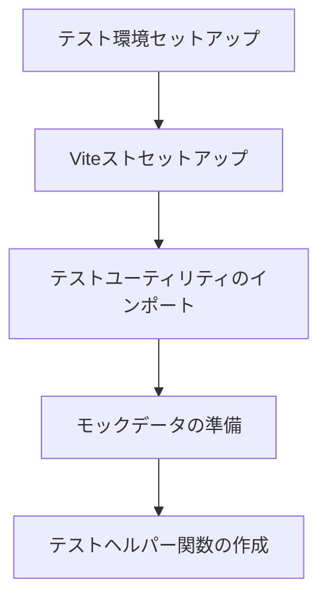
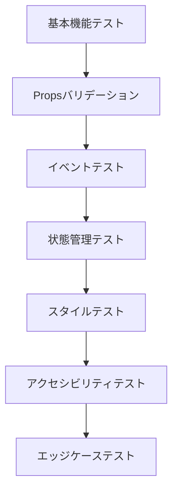
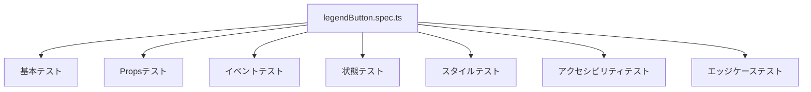

# LegendButtonコンポーネントテスト実装計画

## 1. テスト環境のセットアップ



### 必要なセットアップ
- Vitestの設定
- Vue Test Utilsのセットアップ
- prefecturesMapのモック作成
- 共通のテストヘルパー関数の実装

## 2. テストケースの実装順序



### 2.1 基本機能テスト（優先度：最高）
- コンポーネントのマウント
- 基本構造の確認
- 必須要素の存在確認

### 2.2 Propsバリデーション（優先度：高）
- id（Number型）の検証
- name（String型）の検証
- 必須プロパティの検証

### 2.3 イベントテスト（優先度：高）
- クリックイベントの発火確認
- イベントペイロードの検証
- 複数回クリックの動作確認

### 2.4 状態管理テスト（優先度：中）
- 選択状態の切り替え確認
- 背景色の変更確認
- 状態の永続性確認

### 2.5 スタイルテスト（優先度：中）
- コンポーネントサイズの確認
- 画像サイズの確認
- インタラクションスタイルの確認

### 2.6 アクセシビリティテスト（優先度：中）
- alt属性の確認
- キーボード操作の確認
- フォーカス管理の確認

### 2.7 エッジケーステスト（優先度：低）
- 無効なデータの処理
- パフォーマンステスト
- エラー処理の確認

## 3. テストファイル構造



## 4. モック化戦略

### 4.1 prefecturesMapのモック
```typescript
const mockPrefecturesMap = {
  13: {
    icon: '/mock/path/to/icon.png',
    color: '#BA55D3',
    name: '東京都'
  }
};
```

### 4.2 テストユーティリティ
```typescript
const createWrapper = (props = {}) => {
  return mount(LegendButton, {
    props: {
      id: 13,
      name: '東京都',
      ...props
    },
    global: {
      provide: {
        prefecturesMap: mockPrefecturesMap
      }
    }
  });
};
```

## 5. 実装の注意点

1. テストの独立性を保つ
   - 各テストケース前にコンポーネントを再マウント
   - テスト間で状態が影響しないよう注意

2. 非同期処理の適切な処理
   - nextTickの使用
   - 適切なwaitForの使用

3. スナップショットテストの活用
   - コンポーネントの構造変更の検知
   - スタイルの変更の検知