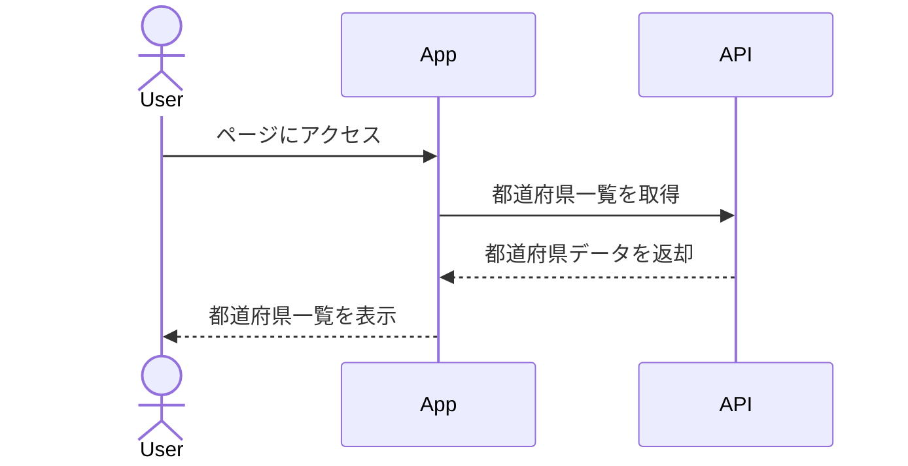
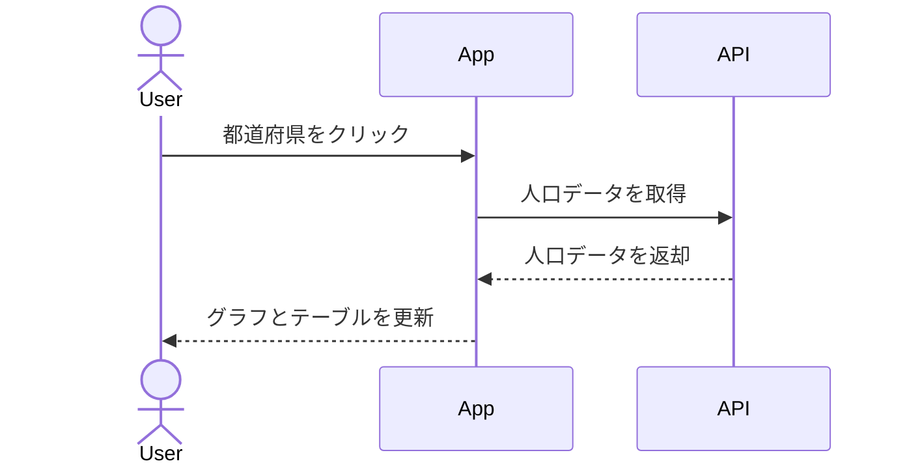

# Population Graph Viewer E2Eテスト仕様書

## 1. 基本機能テスト

### 1.1 初期表示テスト


**テストケース**
- [ ] アプリケーションが正常に読み込まれること
- [ ] ヘッダーが表示されること
- [ ] サイドバーに47都道府県が表示されること
- [ ] グラフエリアが表示されること
- [ ] テーブルエリアが表示されること

### 1.2 都道府県選択テスト


**テストケース**
- [ ] 都道府県をクリックで選択できること
- [ ] 選択された都道府県の人口データがグラフに表示されること
- [ ] 選択された都道府県の人口データがテーブルに表示されること
- [ ] 複数の都道府県を選択できること
- [ ] 選択済みの都道府県を再度クリックで選択解除できること

### 1.3 データ表示切り替えテスト

**テストケース**
- [ ] 総人口タブに切り替えられること
- [ ] 年少人口タブに切り替えられること
- [ ] 生産年齢人口タブに切り替えられること
- [ ] 老年人口タブに切り替えられること
- [ ] タブ切り替え時にグラフとテーブルが更新されること

## 2. レスポンシブ対応テスト

### 2.1 モバイル表示テスト
**テストケース**
- [ ] 画面幅700px以下でレイアウトが縦並びに変更されること
- [ ] モバイル表示でもグラフが正しく表示されること
- [ ] モバイル表示でもテーブルが正しく表示されること
- [ ] モバイル表示でも都道府県選択が可能であること

## テスト実装方針

### 使用ツール
- Playwright
- TypeScript

### テストの構成
```typescript
// テストファイルの基本構造
import { test, expect } from '@playwright/test';

test.describe('Population Graph Viewer', () => {
  test.beforeEach(async ({ page }) => {
    await page.goto('http://localhost:3000');
  });

  test('初期表示テスト', async ({ page }) => {
    // ヘッダーの確認
    await expect(page.locator('app-header')).toBeVisible();
    
    // サイドバーの確認
    const prefectureList = page.locator('pref-side-bar');
    await expect(prefectureList).toBeVisible();
    
    // グラフエリアの確認
    await expect(page.locator('pref-chart')).toBeVisible();
    
    // テーブルエリアの確認
    await expect(page.locator('pref-table')).toBeVisible();
  });

  // 他のテストケース...
});
```

### 実行環境
- 開発環境: localhost:3000
- テスト実行ブラウザ: Chromium, Firefox, WebKit
- デバイス設定:
  - デスクトップ (1280x720)
  - タブレット (768x1024)
  - モバイル (375x667)